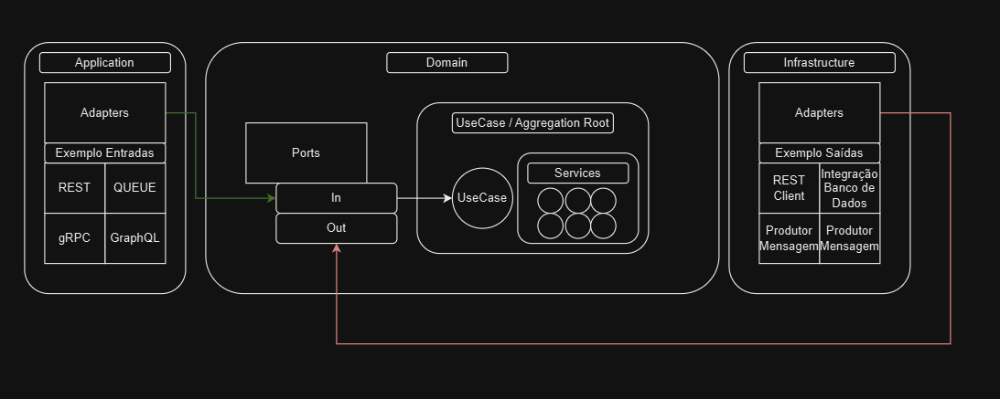

# Arquitetura Hexagonal 

## Adapters e Portas

Se fosse para resumir o padrão hexagonal resumiria em adapters e portas, 
esse conceito vem da necessidade de isolar a camada de domínio da aplicação(regras de negócio) das camadas
de infraestrutura, integrações e apresentação.

### Uma visão de arquitetura


### Portas

Portas são interfaces que definem um contrato de como a aplicação pode ser usada.


### Portas de entrada

As portas de entrada ou portas primárias são contratos de entrada da aplicação, 
normamente são as que implementam nosso aggregation root/use case.

> **NOTA:** Aggregation root é um conceito do DDD que define uma classe que agrega classes especilizadas, 
> como serviços/objetos para atender um objetivo funcional.

### Agregation Root/UseCase

```java
public interface EfetivarPedidoPort {

    ResultadoEfetivacao efetivarPedido(UUID idPedido);

}
```
Implementação exemplo de um use agregation root/usecase dessa porta: 

```java
public class EfefivacaoPedidoUseCase implements EfetivarPedidoPort {

    private PedidoDataPort pedidoDataPort;
    private CheckoutDataPort checkoutDataPort;
    private NoticarCanaisPort noticarCanaisPort;


    public EfefivacaoPedidoUseCase(PedidoDataPort pedidoDataPort,
                                   CheckoutDataPort checkoutDataPort,
                                   NoticarCanaisPort noticarCanaisPort) {
        this.pedidoDataPort = pedidoDataPort;
        this.checkoutDataPort = checkoutDataPort;
        this.noticarCanaisPort = noticarCanaisPort;
    }

    @Override
    public ResultadoEfetivacao efetivarPedido(final UUID idPedido) {
        final Pedido pedido = this.pedidoDataPort.buscarPedido(idPedido);
        final List<ItemCheckout> resultadoValorCheckout = this.checkoutDataPort.buscarItensCheckout();

        final List<ResultadoItemCheckout> resultadoItemCheckouts = resultadoValorCheckout
                .stream().map(itemCheckout -> {
                    CheckoutItemService checkoutItemService = CheckoutStrategy.getStrategy(itemCheckout.tipoCheckout());
                    return checkoutItemService.calculaValorItem(itemCheckout, pedido);
                }).toList();

        final ResultadoEfetivacao resultadoEfetivacao =  new ResultadoEfetivacao(pedido, resultadoItemCheckouts);

        this.noticarCanaisPort.notificarCanais(resultadoEfetivacao, of(SMS, EMAIL, WHATSAPP));

        return resultadoEfetivacao;
    }
    
}
```

### Portas de saída

As portas de saída ou portas secundárias são contratos de saída da aplicação, 
onde o objetivo é isolar o código de implementação de regra de negócio da aplicação de detalhes de infraestrutura.

Nele definimos como a aplicação irá se comunicar com o mundo externo, 
seja banco de dados, serviços, normalmente são implementadas por adapters de repositórios, serviços de terceiros, etc.


```java

public interface PedidoDataPort {

    Pedido buscarPedido(UUID idPedido);

}   
```

## Adapters

Adapter como o nome diz se adaptam aos recuros de dominio exposto pela api.
Uma das coisas que as vezes parece confusa é a implementação no contexto de portas de entrada,
portas de entradas tem normalmente tem como implementaroes na sua maioria por use cases, 
mas existe aplicações super simples como CRUDS que não tem 
uma caracteriscca de negócio muito complexa, nesse caso é importante avaliar a necessidade do hexagonal.
As portas de saida são normamente são as que tem mais adatpers, pois normalmente são as que mais se comunica com o mundo externo. 

Exemplo de implementação de um adapter de porta de saida.

```java

public class PedidoDataPortAdapter implements PedidoDataPort {

    private final PedidoRepository pedidoRepository;

    public PedidoDataPortAdapter(PedidoRepository pedidoRepository) {
        this.pedidoRepository = pedidoRepository;
    }

    @Override
    public Pedido buscarPedido(UUID idPedido) {
        return this.pedidoRepository.findById(idPedido)
                .orElseThrow(() -> new PedidoNaoEncontradoException(idPedido));
    }
}

```